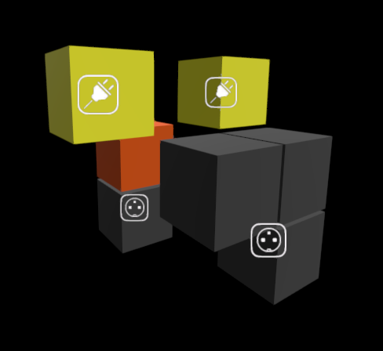

# wire-visualizer
Visualizer (and GPU parallelized simulator) for WireBrains



*The simulation, after unpausing with `p` (it begins paused)*

WireBrains are a cellular automata leveraged as a cognitive substrate for decision-making. They can be optimized through evolutionary algorithms. This tool lets you both simulate and visualize these substrates. This is a full simulation of WireBrains as presented at ALife 2023 at Hokkaido University.

### Key

* **Yellow** currently activated
* **Orange** refractory (cannot be activated)
* **Gray** unactivated
* **Transparent** Not a wire in this configuration

* **Plug-In Icon** Input from external environment
* **Plug-Out Icon** Output to external environment

### Keybindings

* `?` show these keybindings
* `p` pause/unpause
* `f` toggle fullscreen
* `i` toggle input/output icons
* `u` toggle update information
* `m` toggle slow rotation movement (demo mode)
* `s` toggle visual signals between wires
* `t` toggle traces of signal paths
* `c` toggle wire visibility
* `a` toggle alpha transparency of unactivated wires
* `d` toggle debug visual wire IDs
* `esc` close

### Mouse Control

* `scroll` zoom in/out
* `shift+scroll` simulation speed multiplier
* `click+drag` rotate view

### Input / Running

Two files are needed, the overall configuration and the specific activations. For example, here are the configurations for the image above that has two inputs (at the bottom) and two outputs (at the top).

```
./wire_vis -- config.csv activations.csv
```

Mind the double dashes! Everything before the `--` is a general Godot Engine option. Everything after is an option for our specific simulation.

The `config.csv` file

```
name,values
scale,"3,4,3"
wire,"100001000100101000010000010000000000"
wire_active,"100001000100101000010000010000000000"
T0_cells,"0,5"
T1_cells,"19,25"
nrRecurrent,0
clearBetweenUpdates,1
decay,1
brainUpdates,2
```

* scale is the dimension of the 3D wirebrain
* wire is the location (unrolled) of each location that is a wire
* wire_active is the set of wires that will ever be activated
* T0_cells are the inputs
* T1_cells are the outputs
* clearBetweenUpdates is 0 or 1 indicating whether to flush between updates from the environment
* brainUpdates is how many updates the process the WireBrain before processing another enviornment input
* nrRecurrent is unused
* decay is unused

The `activations.csv` file

```
0,-1
-1,0
-1,-1
0,-1
-1,0
-1,-1
```

Each row is an update from the environment to the wires listed in the config file for `T0_cells`. If you recall from above, that config file line is `T0_cells,"0,5"` so each row should indicate the activation status for wires at 0 and 5. the `brainUpdates` config parameter indicates then how many times to step the WireBrain forward before giving it the next line from this file / the next input from the environment.
* `-1` means an input on that wire
* `0` means no input on that wire
